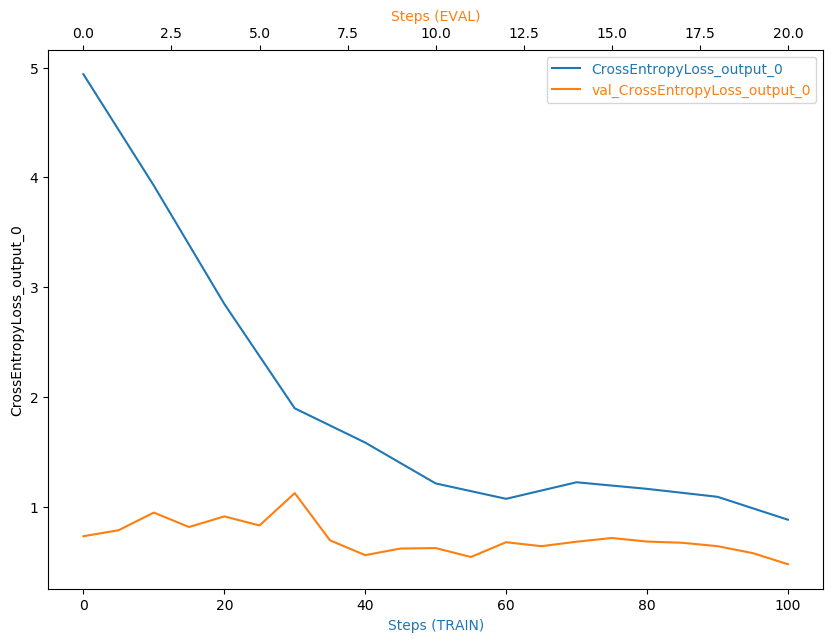
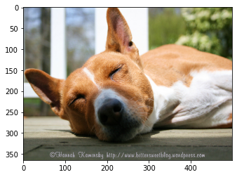

# Image Classification using AWS SageMaker

Use AWS Sagemaker to train a pretrained model that can perform image classification by using the Sagemaker profiling, debugger, hyperparameter tuning and other good ML engineering practices. This can be done on either the provided dog breed classication data set or one of your choice.

## Project Set Up and Installation
Enter AWS through the gateway in the course and open SageMaker Studio. 
Download the starter files.
Download/Make the dataset available. 

## Dataset
The provided dataset is the dogbreed classification dataset which can be found in the classroom.
The project is designed to be dataset independent so if there is a dataset that is more interesting or relevant to your work, you are welcome to use it to complete the project.

### Access
Upload the data to an S3 bucket through the AWS Gateway so that SageMaker has access to the data. 

## Hyperparameter Tuning
ResNet50 was used to find the best hyperparameter configuration for the model. The used hyperparameter ranges were as shown:

```
hyperparameter_ranges = {
    "lr": ContinuousParameter(0.001, 0.1),
    "batch_size": CategoricalParameter([32, 64, 128]),
    "epochs": CategoricalParameter([1, 2])
}
```

One instance of type `ml.c5.2xlarge` was used to create the estimator. The hyperparameter tuning output was as shown below:
```
2022-12-28 03:17:41 Starting - Preparing the instances for training
2022-12-28 03:17:41 Downloading - Downloading input data
2022-12-28 03:17:41 Training - Training image download completed. Training in progress.
2022-12-28 03:17:41 Uploading - Uploading generated training model
2022-12-28 03:17:41 Completed - Resource retained for reuse
{'_tuning_objective_metric': '"average test loss"',
 'batch_size': '"128"',
 'epochs': '"2"',
 'lr': '0.0020447593724576905',
 'sagemaker_container_log_level': '20',
 'sagemaker_estimator_class_name': '"PyTorch"',
 'sagemaker_estimator_module': '"sagemaker.pytorch.estimator"',
 'sagemaker_job_name': '"tuning_job-2022-12-28-02-55-15-207"',
 'sagemaker_program': '"hpo.py"',
 'sagemaker_region': '"us-east-1"',
 'sagemaker_submit_directory': '"s3://sagemaker-us-east-1-092491737666/tuning_job-2022-12-28-02-55-15-207/source/sourcedir.tar.gz"',
 'test-batch-size': '"100"'}
```

We can see that the best configuration was:

| Hyperparameter | Best Value            |
|----------------|-----------------------|
| batch_size     | 128                   |
| epochs         | 2                     |
| lr             | 0.0020447593724576905 |


## Debugging and Profiling
The following configuration was used, and stored in `profiler_config`. After that, three rules were created to account for vanishing gradient, loss not decreasing, and generate a profiler report.
```
profiler_config = ProfilerConfig(
    system_monitor_interval_millis = 500,
    framework_profile_params = FrameworkProfile(num_steps=10)
)

rules = [
    Rule.sagemaker(rule_configs.vanishing_gradient()),
    Rule.sagemaker(rule_configs.loss_not_decreasing()),
    ProfilerRule.sagemaker(rule_configs.ProfilerReport()),
]

hook_config = DebuggerHookConfig(
    hook_parameters = {"train.save_interval": "10", "eval.save_interval": "5"},
    collection_configs = [CollectionConfig(name = "CrossEntropyLoss_output_0",
                                           parameters = {
                                               "include_regex": "CrossEntropyLoss_output_0",
                                               "train.save_interval": "10",
                                               "eval.save_interval": "1"})]
)
```

### Results

The HTML profiler report was saved and uploaded to this GitHub repositery. Additionally, the following plot shows tracking of cross entropy loss output during training steps:



We can see that the cross entropy loss is decreasing with each training step, which indicates a valid model.
## Model Deployment
The model was deployed, and saved to an endpoint called:
`endpoint = best-model-2023-01-03-04-23-22-422`

After that, another model was created using `sagemaker.pytorch.PyTorchModel` to add image serializer and deserializer in it. The new endpoint is called `pytorch-inference-2023-01-03-05-19-09-477`.

In order to invoke the final endpoint of the model, the following cell is used, where you should replace `url` with the URL of the image you want to use for inference.

```
import requests

url= ""

img_bytes = requests.get(url).content

response = predictor.predict(img_bytes, initial_args={"ContentType": "image/jpeg"})

print(response)

import numpy as np
np.argmax(response, 1)
```

The following picture was used as a test, and no errors arised.



To get the final output, use the following code:

```
import numpy as np
np.argmax(response, 1)
```